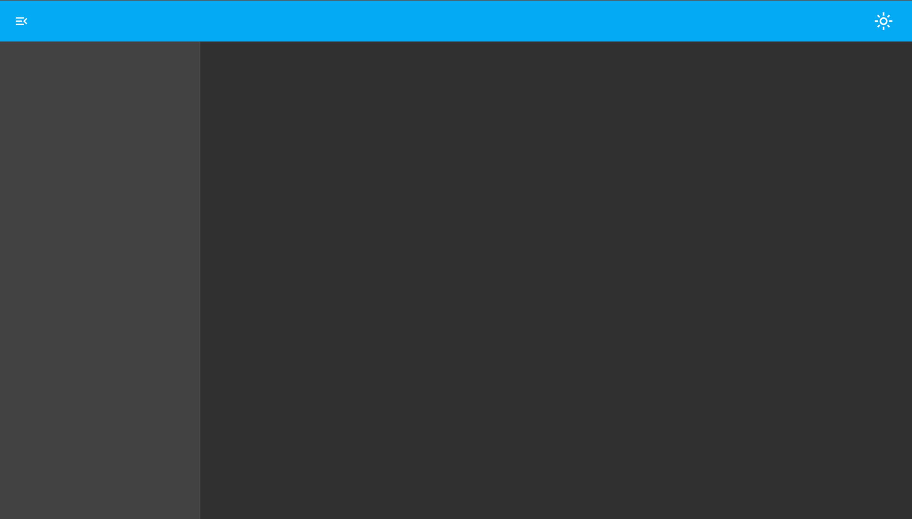
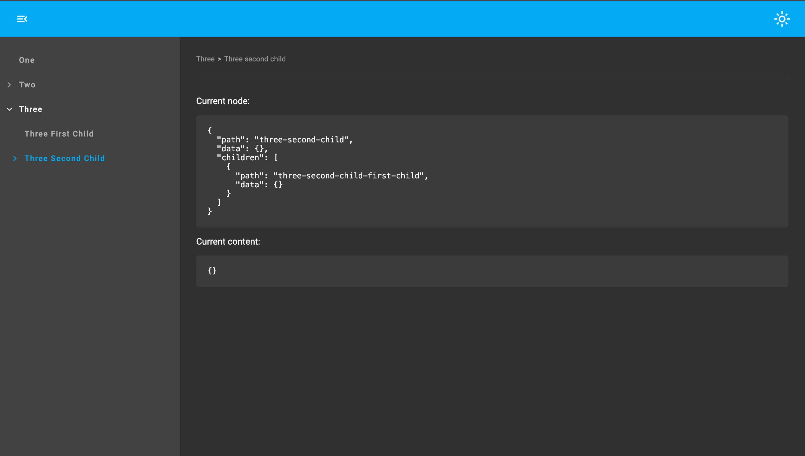
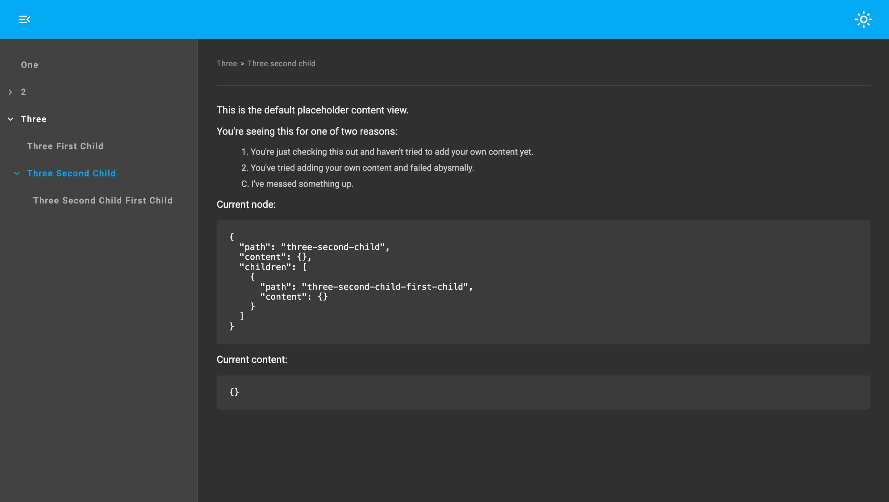

# App Shell
<br/>

# What.

A simple, configurable, app template built with Angular Material components, that's decoupled from both content and router implementation.

You get:

- Colour modes
- Breadcrumbs
- Search input
- Side menu nav tree
- Header slot
- Content slot
- Configurable themes


### Demos

Empty shell - [demo](https://app-shell.jamesrobb.work/demo/) / [source](https://github.com/jamesbrobb/app-shell/tree/main/projects/demo/src/app)



Concrete angular routes - [demo](https://app-shell.jamesrobb.work/concrete-routes-demo/) / [source](https://github.com/jamesbrobb/app-shell/tree/main/projects/concrete-routes-demo/src/app)



Dynamic routes - [demo](https://app-shell.jamesrobb.work/dynamic-routes-demo/) / [source](https://github.com/jamesbrobb/app-shell/tree/main/projects/dynamic-routes-demo/src/app) - implemented with [@jamesbenrobb/dynamic-routes-ngx](https://github.com/jamesbrobb/dynamic-routes)



<br/>

# Why.

Whilst creating [Documentor](https://github.com/jamesbrobb/documentor) it occurred to me that it would be useful to abstract out the underlying dynamic routing implementation/behaviour to use for other apps.

Annoyingly, once this was complete, it then occurred to me that it would also be useful to abstract out the UI app shell to use with different routing solutions. This is the result.

Examples of use:

1. [Angular router inspector](https://angular-router-inspector.jamesrobb.work)
2. [Portfolio V3](https://portfolio-v3.jamesrobb.work)
3. [JBR Libs docs](https://jbr-docs.jamesrobb.work)
<br/><br/>


# How.

1. [Install](#install)
2. [Include styles](#include-styles)
3. [Add providers](#add-providers)
4. [Add the layout component](#add-the-layout-component)
5. [Configure for your own use](#configure-for-your-own-use)
   <br/><br/>


### Install

```bash
npm i @jamesbenrobb/app-shell@latest
```
<br/>


### Include styles

```scss
@use "@jamesbenrobb/app-shell" as app-shell;

@include app-shell.setJBRAppShellVars();
```
<br/>


### Add providers

```ts
import {ApplicationConfig} from '@angular/core';
import {getJBRAppShellProviders} from "@jamesbenrobb/app-shell";


export const appConfig: ApplicationConfig = {
  providers: [
    getJBRAppShellProviders()
  ]
};
```
<br/>


### Add the layout component

```ts
import { Component } from '@angular/core';
import {AppShellLayoutComponent} from "@jamesbenrobb/app-shell";


@Component({
  selector: 'app-root',
  standalone: true,
  imports: [
    AppShellLayoutComponent
  ],
  template: `
    <jbr-app-shell-layout>
    </jbr-app-shell-layout>
  `,
  styleUrl: './app.component.scss'
})
export class AppComponent {}
```
<br/>

# Configure for your own use.

1. [Provider options](#provider-options)
2. [Configure navigation](#configure-navigation)
3. [Configure search input](#configure-search-input)
4. [Add your own content](#add-your-own-content)
5. [Add your own header content](#add-your-own-header-content)
6. [Add your own side menu component](#add-your-own-side-menu-component)
7. [Declare your own light and dark themes](#declare-your-own-light-and-dark-themes)
   <br/><br/>

### Provider options

```ts
export type AppShellOptions = {
  displayColorModeBtn?: boolean,
  displayBreadcrumbs?: boolean,
  sideMenuComponentType?: string
}
```
<br/>

### Configure navigation

The following tokens are exposed:

 - [`AppShellMenuConfigService`](https://github.com/jamesbrobb/app-shell/blob/main/libraries/app-shell/src/lib/providers/menu.providers.ts)
 - [`AppShellRouteManagerService`](https://github.com/jamesbrobb/app-shell/blob/main/libraries/app-shell/src/lib/providers/route.providers.ts)

```ts
import {Provider} from "@angular/core";
import {NavConfig, NavItemNode} from "@jamesbenrobb/ui";
import {AppShellMenuConfigService, AppShellRouteManagerService} from "@jamesbenrobb/app-shell";
import {Router} from "@angular/router";

const navMenuProvider: Provider = {
  provide: AppShellMenuConfigService,
  useFactory: () => convertRoutes(inject(Router).config)
}

const routeManagerProvider: Provider = {
  provide: AppShellRouteManagerService,
  useFactory: () => new DefaultAngularRouteManager(inject(Router))
}


function convertRoutes(): NavConfig {
    const items: NavConfig = // logic that converts angular routes into an array of NavItemNode 
    return items;
}


class DefaultAngularRouteManager implements AppShellRouteManager {

  readonly #router: Router;

  readonly urlChange$: Observable<string>

  constructor(router: Router) {
    this.#router = router;

    this.urlChange$ = this.#router.events.pipe(
      filter((event): event is NavigationEnd => event instanceof NavigationEnd),
      map((event: NavigationEnd) => {
        return (event as NavigationEnd).url;
      })
    );
  }

  navigateByUrl(path: string): void {
    this.#router.navigateByUrl(path);
  }
}
```

Or use the [`getJBRAppShellAngularRouterProviders`](https://github.com/jamesbrobb/app-shell/blob/main/libraries/app-shell-routing-adaptors/src/lib/angular-router/providers.ts) helper provider in [`@jamesbenrobb/app-shell-routing-adaptors`](https://github.com/jamesbrobb/app-shell/tree/main/libraries/app-shell-routing-adaptors), which does exactly the same as above.

```ts
import {ApplicationConfig} from '@angular/core';
import {getJBRAppShellProviders} from "@jamesbenrobb/app-shell";
import {getJBRAppShellAngularRouterProviders} from "@jamesbenrobb/app-shell-routing-adaptors"
import {routes} from "./app.routes";


export const appConfig: ApplicationConfig = {
  providers: [
    getJBRAppShellProviders(),
    getJBRAppShellAngularRouterProviders(routes)
  ]
};
```
<br/>

### Configure search input

The following token is exposed:

- [`AppShellSearchService`](https://github.com/jamesbrobb/app-shell/blob/main/libraries/app-shell/src/lib/providers/search.providers.ts)

By providing this token the search input is automatically displayed in the header.

```ts
import {Observable, Subject} from "rxjs";
import {SearchService} from '@jamesbenrobb/app-shell';


const provider: Provider = {
  provide: AppShellSearchService,
  useClass: MySearchService
}

class MySearchService implements SearchService<string> {

  readonly #results = new Subject<string[]>();
  readonly results$: Observable<string[]> = this.#results.asObservable();

  search(query: string): void {
    const result: string[] = // search something
    this.#results.next(result);
  }
}
```
<br/>

### Add your own side menu component

By default a slightly modified version of `mat-tree` is used.
If you wish to supply your own menu first create a menu component that implements [`SideMenuComponentIO`](https://github.com/jamesbrobb/dynamic-routes-app/blob/main/libraries/dynamic-routes-ngx/src/lib/components/side-menu-loader/side-menu-loader.directive.ts#L8)

```ts
import {Component, Input, Output} from "@angular/core";
import {SideMenuComponentIO} from "@jamesbenrobb/app-shell";
import {NavItemNode} from "@jamesbenrobb/ui";


@Component({
  selector: 'my-side-menu',
  templateUrl: '...',
  styleUrls: ['...'],
  standalone: true
})
export class MySideMenuComponent implements SideMenuComponentIO {
  @Input() menuNodes?: NavItemNode[];
  @Input() currentNodes?: NavItemNode[];

  @Output() nodeSelected = new EventEmitter<NavItemNode>();
}
```

Register the component with the `ComponentLoaderMapService` (see details on registering components [here](https://github.com/jamesbrobb/jbr/tree/main/libraries/ui/src/lib/component-loader)) and add the provider to your app

```ts
import {Provider} from "@angular/core";
import {ComponentLoaderMapService} from "@jamesbenrobb/ui";


const provider: Provider = {
  provide: ComponentLoaderMapService,
  useValue: {
    'my-side-menu': {
      import: () => import('./my-side-menu.component'),
      componentName: 'MySideMenuComponent'
    }
  },
  multi: true
}
```
Supply the registered name of you side menu component to `getJBRAppShellProviders`

```ts
import {ApplicationConfig} from '@angular/core';
import {getJBRAppShellProviders} from "@jamesbenrobb/app-shell";


export const appConfig: ApplicationConfig = {
  providers: [
    getJBRAppShellProviders({
      sideMenuComponentType: 'my-side-menu'
    })
  ]
};
```
<br/>

### Add your own content

The app layout component has a default unnamed content slot.

```html
<jbr-app-shell-layout>
  <div>I'm the content</div>
</jbr-app-shell-layout>
```
<br/>

### Add your own header content

The app layout component header has a named content slot that can be used to project bespoke content.

```html
<jbr-app-shell-layout>
  <div jbr-dra-header-content>I'm the header text</div>
</jbr-app-shell-layout>
```
<br/>

### Declare your own light and dark themes

Approximately 90% of the app uses Angular Material components and the other 10% support being themed.

To supply your own themes the `setJBRAppShellVars` mixin has the following optional arguments:

```scss
@use '@angular/material' as mat;
@use "@jamesbenrobb/app-shell" as app-shell;

@include app-shell.setJBRAppShellVars(
    $light-theme, // an Angular material light theme created with mat.define-light-theme
    $dark-theme, // an Angular material dark theme created with mat.define-dark-theme
    $typography, // an Angular material typography config created with mat.define-typography-config
    $side-menu-width // a custom width for the side menu - defaults to 320px
);
```
The app also comes with a light/dark mode switch that sets a `data-*` attribute on body.
When explicitly selected, the switch also stores the users preference in `LocalStorage`, overriding the mode of the OS.
The following can be used to style your own components
```html
<body [data-color-mode]="light">
...
</body>
```
or
```html
<body [data-color-mode]="dark">
...
</body>
```

